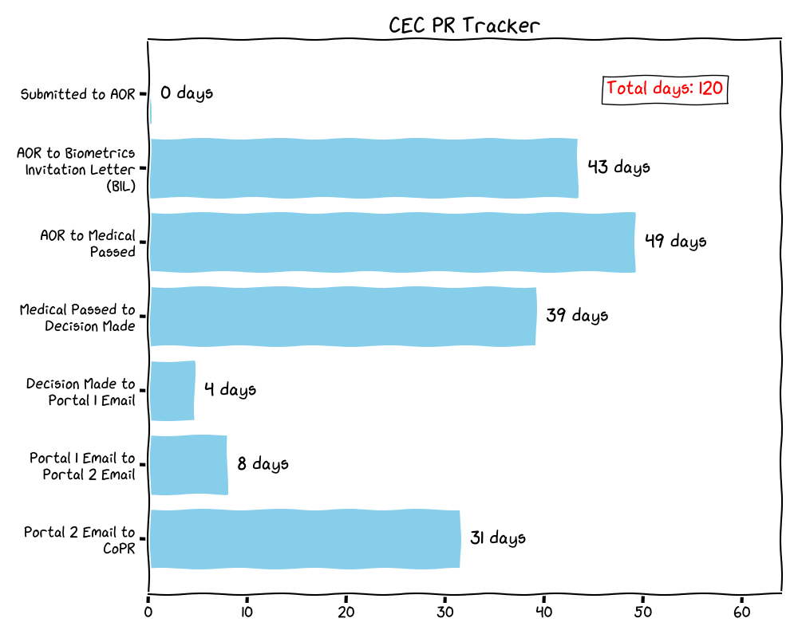

# Immix Tracker Suite

## Table of Contents
- [Overview](#immix-tracker-suite)
- [Canadian Citizenship Tracker](#canadian-citizenship-tracker)
- [Canadian PR Trackers](#canadian-pr-trackers)
  - [CEC PR Tracker](#cec-pr-tracker)
  - [Spousal PR Tracker](#spousal-pr-tracker)
- [Usage](#usage)

This repository provides trackers for processing times in various Canadian immigration and citizenship processes. The graphs are updated weekly with the latest data, so you can rely on the updated version of these images without necessarily running the scripts.

---

## Canadian Citizenship Tracker

This tracker displays the average time for each processing step in the Canadian citizenship process. The graph below is updated weekly with the latest data.

### Total Days
The total processing time from "Application Sent" to "Oath Ceremony" is displayed at the top-right corner of the graph.

_Last updated: 2024-12-11 22:50:36_

---

## Canadian PR Trackers

### CEC PR Tracker

This tracker displays the average time for each processing step in the Canadian CEC PR process. The graph below is updated weekly with the latest data.

### Total Days
The total processing time from "AOR" to "CoPR" is displayed at the top-right corner of the graph.

_Last updated: 2024-12-11 22:50:36_

---

### Spousal PR Tracker

This tracker displays the average time for each processing step in the Canadian Spousal PR process. The graph below is updated weekly with the latest data.

### Total Days
The total processing time from "Application Submitted" to "Passport Request" is displayed at the top-right corner of the graph.

_Last updated: 2024-12-11 22:50:36_

